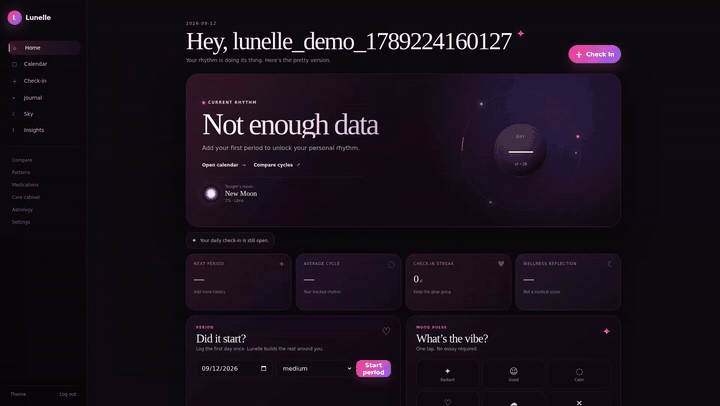
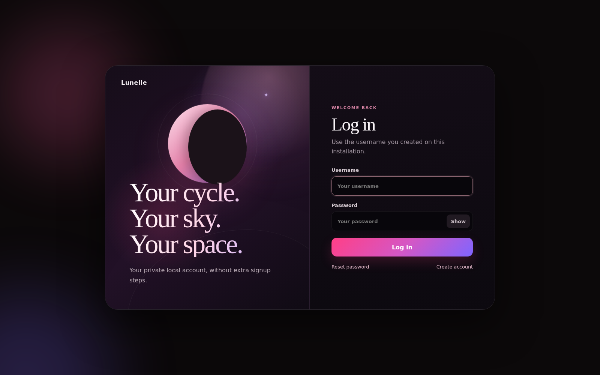
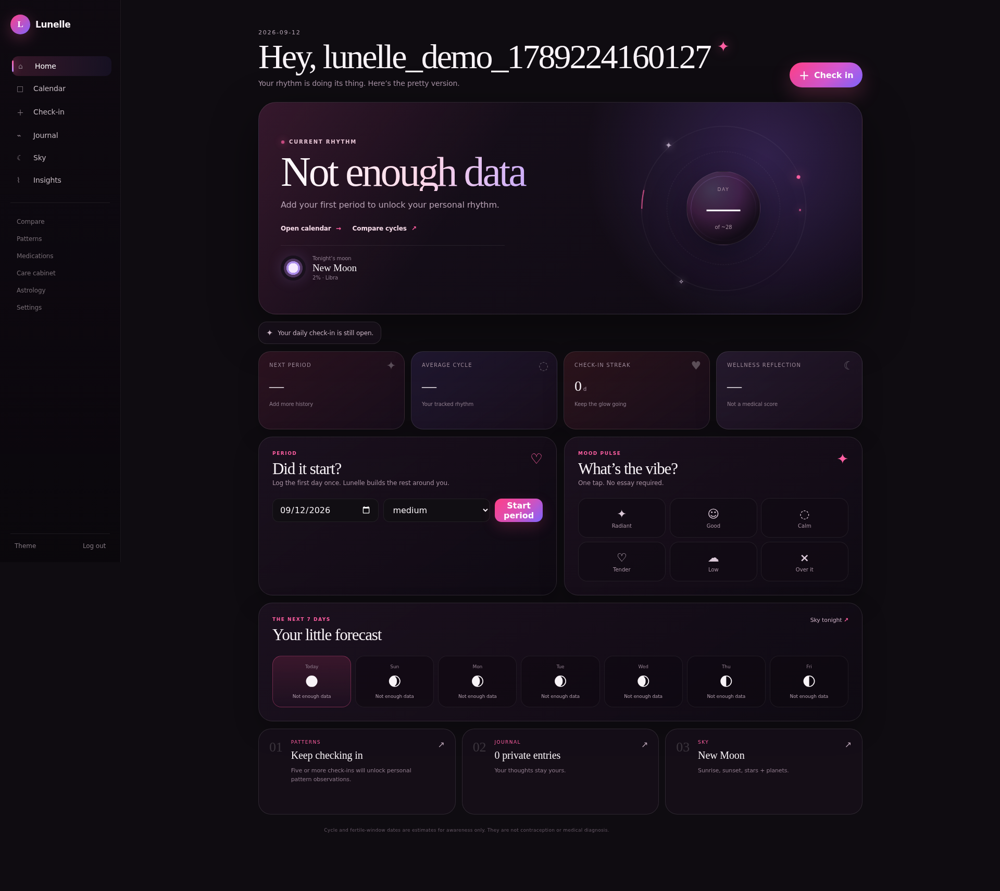
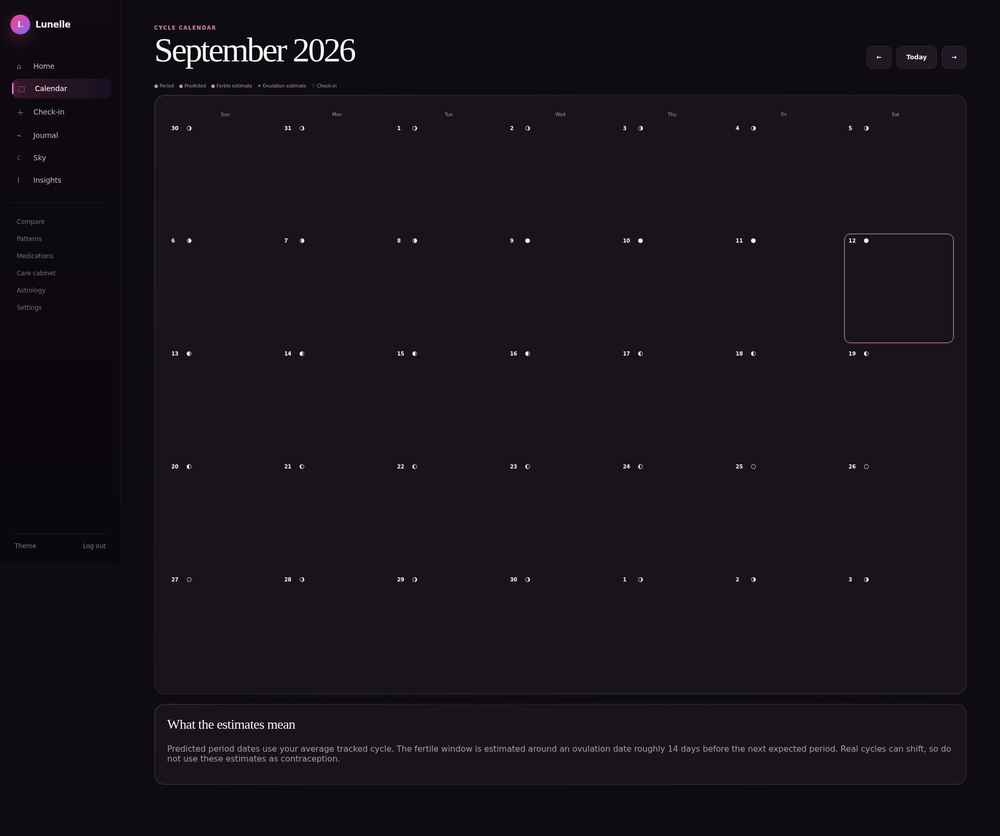
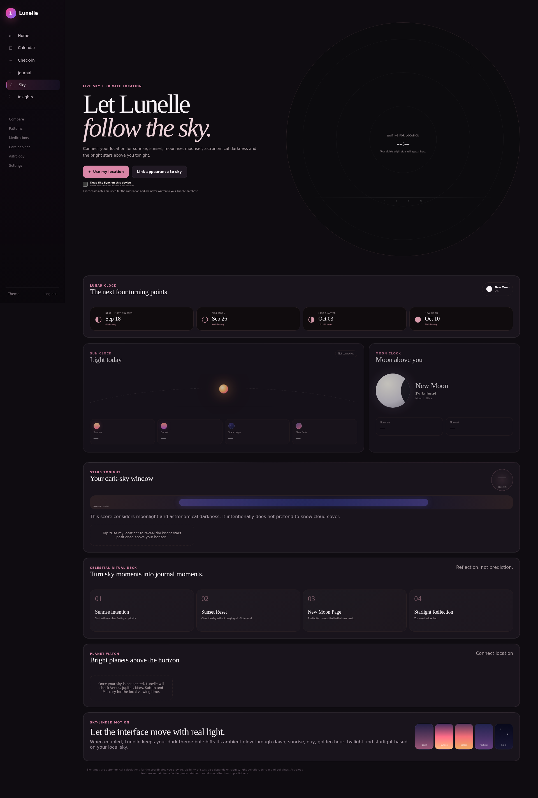
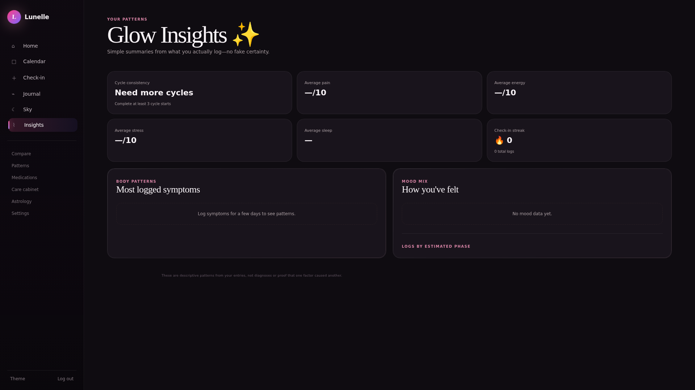
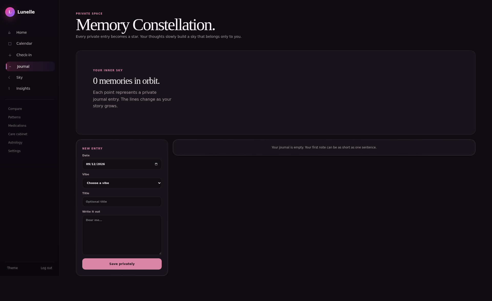

<div align="center">

# 🌙 Lunelle

### Private cycle intelligence with a living connection to your sky.

<p>
  <a href="https://github.com/iamrichmack111/lunelle/releases/latest"></a>
  <a href="https://github.com/iamrichmack111/lunelle/wiki"></a>
  <a href="https://github.com/iamrichmack111/lunelle/pkgs/container/lunelle"></a>
  <a href="https://github.com/iamrichmack111/lunelle/releases"></a>
</p>


</div>

---

## ✦ What is Lunelle?

**Lunelle** is a private cycle and wellness companion that combines menstrual tracking, journaling, personal patterns, moon phases, planetary ephemeris data, sunrise/sunset timing, and an animated sky-aware interface.

It is designed as a personal wellness tool — not a diagnostic system and not a contraceptive method.

## 🎥 Product demo

[](https://github.com/iamrichmack111/lunelle/releases/latest)

**▶ Click the animation for the full HD narrated demo.**

The README uses a lightweight animated preview so GitHub can render it reliably.  
The full H.264 narrated product demo is attached to the latest GitHub Release.


## 🖼️ Screens

<table>
<tr>
<td width="50%"></td>
<td width="50%"></td>
</tr>
<tr>
<td></td>
<td></td>
</tr>
<tr>
<td></td>
<td></td>
</tr>
</table>

## ✨ Highlights

- 🩸 Period start/end tracking and personalized cycle estimates
- 🌙 Moon phase, lunar events and cycle × cosmos views
- 🌅 Sunrise, sunset, twilight and local Sky Sync
- ⭐ Stars/planet visibility and stargazing information
- 📓 Private journal and memory history
- 💗 Mood, pain, energy, sleep, stress and symptom check-ins
- 📊 Cycle Compare and descriptive pattern discovery
- 💊 Medication/supplement tracking
- 👜 Care-product inventory
- 🔐 Username/password authentication + optional PIN privacy layer
- 📦 CSV/JSON data export
- 📱 Installable PWA
- 🎨 Multiple dark feminine themes
- 🐳 Docker + GHCR delivery
- 🎭 Automated Playwright screenshots/video

## 🧭 Architecture


D2 source: [`docs/architecture.d2`](docs/architecture.d2)

## 🚀 Run locally

```bash
python3 -m venv .venv
source .venv/bin/activate
pip install -r requirements.txt
./start.sh
```

Open:

```text
http://127.0.0.1:5055
```

## 🐳 Docker

Build:

```bash
docker build -t lunelle .
```

Run with persistent private data:

```bash
docker run --rm \
  -p 5055:5055 \
  -v lunelle-data:/data \
  -e SECRET_KEY="$(openssl rand -hex 32)" \
  lunelle
```

Or pull this repository's private GHCR image:

```bash
echo "$(gh auth token)" | docker login ghcr.io -u iamrichmack111 --password-stdin
docker pull ghcr.io/iamrichmack111/lunelle:latest
docker run --rm -p 5055:5055 -v lunelle-data:/data ghcr.io/iamrichmack111/lunelle:latest
```

## 🧪 Capture the demo again

```bash
cd tools/demo
npm install
npx playwright install chromium
BASE_URL=http://127.0.0.1:5055 npm run demo
```

The recorder creates a disposable account against a fresh Docker database so **real user health data is never needed for repository screenshots or video**.

## 🔏 Privacy

Lunelle stores sensitive cycle data locally in SQLite by default. Database files and local secret keys are excluded from Git.

Before any public/commercial deployment, add production-grade HTTPS, secure secret storage, formal privacy documentation, account lifecycle controls, backups/encryption, and a security review.

## 📚 Documentation

- [Wiki](https://github.com/iamrichmack111/lunelle/wiki)
- [Architecture](https://github.com/iamrichmack111/lunelle/wiki/Architecture)
- [Docker](https://github.com/iamrichmack111/lunelle/wiki/Docker)
- [Privacy](https://github.com/iamrichmack111/lunelle/wiki/Privacy-and-Security)
- [Roadmap](https://github.com/iamrichmack111/lunelle/wiki/Roadmap)

## ⚕️ Health disclaimer

Predictions and pattern summaries are estimates for personal awareness only. Lunelle does not diagnose health conditions and should not be used as contraception or as a replacement for medical advice.

---

<div align="center">

**Lunelle v1.5.1**

Private by design · animated by the sky

</div>
